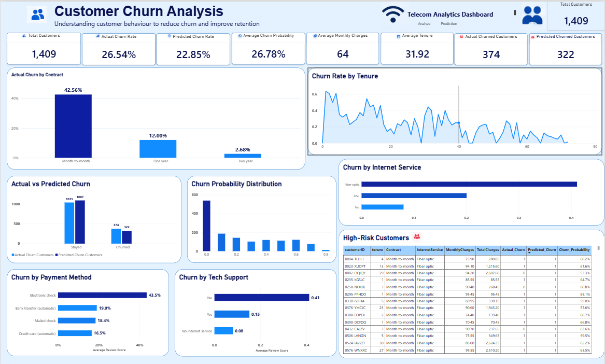
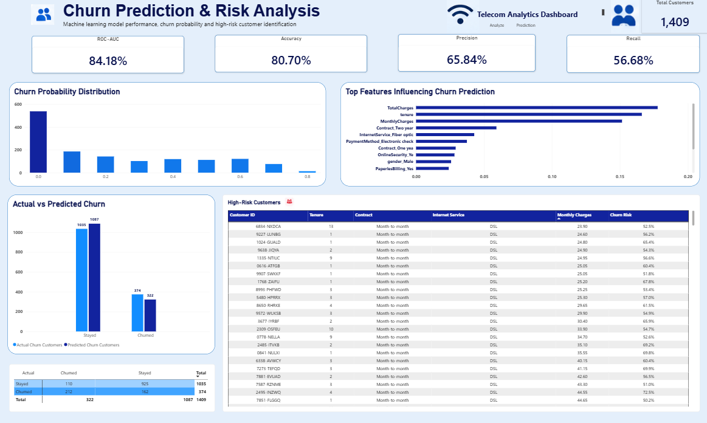

# Customer Churn Prediction

An end-to-end customer churn prediction project using Python, Machine Learning, and Power BI to identify customers at risk of leaving a telecom service.

## 📌 Project Overview

Customer churn is a major business challenge for subscription-based companies. Identifying customers who are likely to leave allows businesses to prioritize retention efforts and better understand the factors associated with customer churn.

This project analyzes the IBM Telco Customer Churn dataset and develops machine learning models to predict customer churn.

The project combines:

- Data cleaning and exploratory data analysis
- Statistical and business analysis
- Machine learning classification
- Model evaluation
- Customer-level churn probability
- Power BI business intelligence dashboard

---

## 🎯 Business Problem

The objective of this project is to answer the following questions:

1. What proportion of customers churn?
2. Which customer characteristics are associated with higher churn rates?
3. Can machine learning predict customers who are likely to churn?
4. Which customers have the highest predicted churn probability?
5. How can the predictions support customer retention decisions?

---

## 📊 Dataset

The project uses the **IBM Telco Customer Churn dataset**.

The dataset contains:

- **7,043 customers**
- **21 original columns**
- Customer demographics
- Account information
- Services subscribed
- Billing information
- Contract information
- Churn status

### Target Variable

`Churn`

- `Yes` → Customer churned
- `No` → Customer stayed

---

## 🛠️ Tools & Technologies

### Data Analysis
- Python
- Pandas
- NumPy

### Data Visualization
- Matplotlib
- Seaborn

### Machine Learning
- Scikit-learn
- Logistic Regression
- Random Forest

### Business Intelligence
- Microsoft Power BI

### Development
- Jupyter Notebook
- Visual Studio Code
- Git & GitHub

---

## 🧹 Data Preparation

The following preparation steps were performed:

- Inspected dataset structure and data types
- Checked missing values
- Converted `TotalCharges` from text to numeric
- Identified and handled 11 blank `TotalCharges` values
- Verified that the converted dataset contained no missing `TotalCharges` values
- Separated features and target variable
- Encoded categorical variables
- Created a machine-learning-ready feature matrix

Final feature matrix:

**7,043 customers × 30 encoded features**

---

## 🔎 Exploratory Data Analysis

Several customer characteristics were analyzed to understand churn patterns.

### Overall Churn

- Customers who stayed: **5,174**
- Customers who churned: **1,869**
- Overall churn rate: **26.54%**

### Contract Type

Observed churn rates:

| Contract | Churn Rate |
|---|---:|
| Month-to-month | 42.71% |
| One year | 11.27% |
| Two year | 2.83% |

### Internet Service

| Internet Service | Churn Rate |
|---|---:|
| Fiber optic | 41.89% |
| DSL | 18.96% |
| No internet service | 7.40% |

### Payment Method

Electronic check customers had an observed churn rate of approximately **45.29%**, compared with lower observed rates for the other payment methods.

### Tenure

Customers who churned had:

- Mean tenure: **17.98 months**
- Median tenure: **10 months**

Customers who stayed had:

- Mean tenure: **37.57 months**
- Median tenure: **38 months**

### Monthly Charges

Average monthly charges were:

- Stayed customers: **$61.27**
- Churned customers: **$74.44**

These findings describe associations in the dataset and should not be interpreted as proof of causation.

---

## 🤖 Machine Learning

Two classification models were developed:

### 1. Logistic Regression

Logistic Regression was used as an interpretable baseline classification model.

### 2. Random Forest

Random Forest was used as a tree-based classification model to capture potentially nonlinear relationships between customer characteristics and churn.

The dataset was divided into:

- **80% training data**
- **20% testing data**

Training set:

**5,634 customers**

Testing set:

**1,409 customers**

---

## 📈 Model Performance

### Logistic Regression

| Metric | Result |
|---|---:|
| Accuracy | 80.70% |
| Precision | 65.84% |
| Recall | 56.68% |
| F1 Score | 60.92% |
| ROC-AUC | 84.18% |

### Random Forest

| Metric | Result |
|---|---:|
| Accuracy | 77.50% |
| Precision | 56.61% |
| Recall | 65.24% |
| F1 Score | 60.62% |
| ROC-AUC | 82.76% |

The models show different trade-offs. Logistic Regression produced higher accuracy, precision, F1 score, and ROC-AUC in this test, while Random Forest produced higher recall.

---

## 🔬 Feature Importance

The Random Forest model identified several features with relatively high importance, including:

1. `TotalCharges`
2. `tenure`
3. `MonthlyCharges`
4. `Contract`
5. `InternetService`
6. `PaymentMethod`
7. `OnlineSecurity`
8. `TechSupport`

Feature importance indicates how much the model relied on these variables for prediction. It does not establish a causal relationship between a feature and churn.

---

## 📋 Customer-Level Predictions

The project generates customer-level predictions containing:

- Customer ID
- Customer characteristics
- Actual churn status
- Predicted churn status
- Churn probability

Customers predicted as high-risk can be identified for further business analysis.

The current test dataset contains:

- **1,409 customers**
- **374 actual churners**
- **322 predicted churners**
- **26.78% average churn probability**

---

## 📊 Power BI Dashboard
### Analyze Dashboard



### Prediction Dashboard



The machine learning predictions were exported to CSV and used to create an interactive Power BI dashboard.

### Analyze Page

The dashboard provides an overview of:

- Total customers
- Actual churn rate
- Predicted churn rate
- Average churn probability
- Average monthly charges
- Average tenure
- Actual vs predicted churn
- Churn probability distribution
- Churn rates across customer segments

### Prediction Page

The prediction-focused page provides:

- Model performance metrics
- Churn probabilities
- Actual vs predicted churn
- High-risk customer identification
- Customer-level prediction analysis

---

## 💡 Business Insights

The analysis highlights several patterns that can support retention analysis:

- Month-to-month customers show a substantially higher observed churn rate than customers on longer contracts.
- Customers with shorter tenure show higher observed churn.
- Fiber-optic customers have a higher observed churn rate in this dataset.
- Electronic-check customers show a relatively high observed churn rate.
- Customers with higher monthly charges show higher average churn among the observed groups.
- The machine learning model can assign individual churn probabilities to help prioritize customers for further investigation.

These findings represent patterns in the dataset and should be validated against additional business and customer data before operational decisions are made.

---

## 🚀 Project Workflow

```text
Raw Dataset
     ↓
Data Cleaning
     ↓
Exploratory Data Analysis
     ↓
Feature Engineering
     ↓
Categorical Encoding
     ↓
Train/Test Split
     ↓
Machine Learning
     ↓
Model Evaluation
     ↓
Customer Churn Predictions
     ↓
Power BI Dashboard